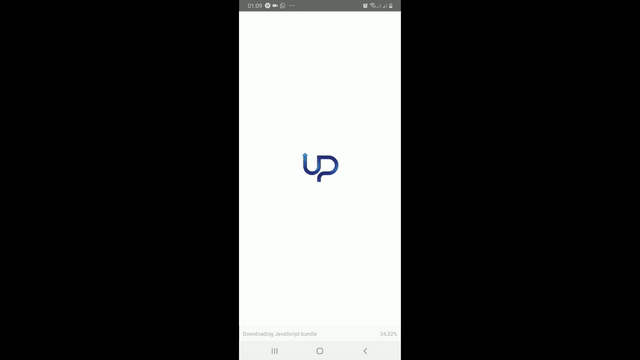

# trade-up-users
Um CRUD com autenticação e duas páginas que exibem os dados providos de uma API Rest pela TradeUp Group.

# Users App



### Instalação

O projeto foi criado utilizando-se o Expo CLI. Para usá-lo, utilize o seguinte comando:

```
npm install -g expo-cli
```

Agora, basta ir a pasta do projeto e instalar os pacotes e dependências do projeto:

```
npm install
```

Para iniciar o servidor de desenvolvimento, utilize o comando abaixo:

```
npm start
```

Instale o app Expo no dispositivo móvel de teste, e faça a leitura do QR Code para rodar a aplicação.

### Dependências

Este projeto utiliza-se das seguintes dependências:

- expo: Utilizado pela facilidade de usar a aplicação em plataformas IOS e Android, sem a necessidade de instalar a SDK do Android ou o XCode.
- axios: Utilizado para fazer as requisições HTTP. Usado nesse projeto por facilitar as chamadas ao servidor com o uso das Promises.
- react-native-vector-icons: Utilizado para inserir ícones na aplicação. Foi utilizado por conter uma grande variedade de ícones disponíveis gratuitamente.
- react-navigation, react-native-gesture-handler, react-native-reanimated e react-navigation-stack: Utilizado para criar as rotas e navegação do app. Foi utilizado pela facilidade de uso na chamada de telas, e por ser altamente personalizável.
- react-redux e redux: Utilizado no armazenamento de informações e estados da aplicação. Foi utilizado por conter um recurso de informações centralizadas e facilmente compartilhadas entre as telas da aplicação.